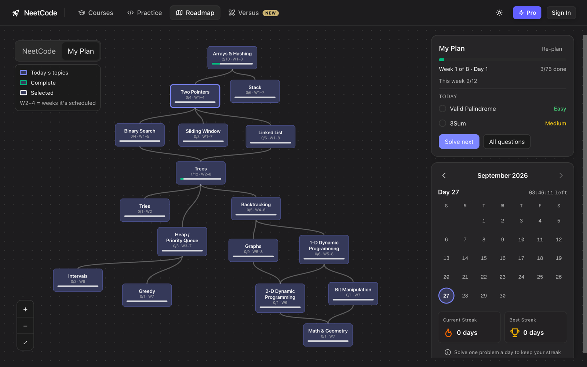

<p align="center">
  
</p>

<h1 align="center">NeetGrind</h1>

<p align="center">
  Build a study plan on <a href="https://www.techinterviewhandbook.org/grind75">Grind 75</a>, then follow it on <a href="https://neetcode.io/roadmap">NeetCode's roadmap</a>.
  <br>
  A free, open-source userscript. Solving problems in NeetCode's editor keeps your daily streak going.
</p>

<p align="center">
  
</p>

## Features

- **Your plan, NeetCode's graph.** Pick weeks, hours and difficulty on Grind 75. The same questions show up on NeetCode's roadmap, with progress for each topic.
- **Today's questions.** A card above NeetCode's streak calendar shows what to solve today, the week you're in, and whether you're behind.
- **Research-backed order.** The default order starts each topic on its own, then mixes topics together and spaces out reviews. See [how it works](docs/research.md).
- **Company tags.** Pick the companies you're interviewing with. Their most-asked LeetCode questions from the last 30 days, 3 months, 6 months or all time go into your plan first, filtered by your difficulty and topics. Every company-tagged question shows a 🏢 badge naming the company.
- **Your choice of topics.** Turn off topics you don't need (e.g. Bit Manipulation), and their hours go to other questions.
- **Read-only.** NeetGrind reads your NeetCode progress from your browser and never writes to NeetCode.

## Install

1. Install [Tampermonkey](https://www.tampermonkey.net/). In Chrome, also turn on **Allow User Scripts** for it (`chrome://extensions` → Tampermonkey → Details).
2. **[Install NeetGrind](https://raw.githubusercontent.com/aeironnsarmiento/neetgrind/main/dist/neetgrind.user.js)**. Tampermonkey opens an install page; click **Install**.

Updates install automatically through Tampermonkey.

## Use

1. **Make a plan.** Open [Grind 75](https://www.techinterviewhandbook.org/grind75) and set your weeks, hours and difficulty. Pick a start date in the **NeetGrind** panel (bottom right) and click **Send to NeetCode**.
2. **Open [neetcode.io/roadmap](https://neetcode.io/roadmap)** and switch **NeetCode → My Plan** (top left).
3. **Solve.** Click **Solve next**, or click a topic to see its questions. Your progress updates as you solve problems on NeetCode.

You can also change weeks, hours, difficulty, order, grouping, topics or companies any time with **Re-plan** on NeetCode.

### Company tags

In **Re-plan → Company tags**:
1. Add one or more companies.
2. Pick how recent the questions should be: 30 days, 3 months, 6 months or all time.
3. Pick how many to include:
   - **Top N per company**: the N most frequent questions for each company.
   - **Share of time**: company questions fill that % of your hours, taking turns between companies.
4. Optionally, **Choose questions…** to hand-pick specific ones. Picked questions are always included.

Company questions are chosen before Grind 75's, and Grind 75 fills whatever time is left. With too little time, Grind 75 questions are dropped first. Questions Grind 75 doesn't have get a time estimate (Easy 20m, Medium 30m, Hard 40m) and a topic from their LeetCode tags.

### Reading the graph

| | Meaning |
|---|---|
| Purple outline | Topic in today's questions |
| Green outline | Topic complete |
| White outline | Topic you clicked |
| `2/6 · W1–4` | 2 of 6 done, scheduled in weeks 1–4 |

Topics with no questions in your plan are hidden.

### Orders

| Order | What you get |
|---|---|
| **Recommended** (default) | Each topic starts with 2–3 easy questions, then comes back later as mixed, spaced review. The last week is fully mixed, like an interview. Review questions show "Review" instead of their topic, so you practise spotting the pattern. |
| Difficulty (Grind 75 default) | Exactly Grind 75's weeks: all Easies, then Mediums, then Hards. |
| Topics (Grind 75) | Grind 75 grouped by its own topics. |
| All rounded | Grind 75's priority order. |
| NeetCode roadmap | One topic at a time, in roadmap order, with no review. |

Every order uses the same questions, chosen by Grind 75. Only when each one comes up changes.

## FAQ

**Does this count toward my NeetCode streak?**
Solving a problem in NeetCode's editor counts. Every NeetGrind link opens the NeetCode problem page. The 15 Grind 75 questions NeetCode doesn't have are marked **LC**, link to LeetCode, and are ticked off inside NeetGrind.

**Does it change my NeetCode account?**
No. NeetGrind only reads progress NeetCode already loads in your browser. When you're logged in, NeetCode keeps your progress on its server, so NeetGrind reads the responses NeetCode's own page receives (your solved list, checkbox clicks, and Accepted submissions). It never sends requests of its own or touches your login.

**A solved problem isn't ticked.**
Open [neetcode.io/roadmap](https://neetcode.io/roadmap) once in a tab where NeetGrind is running; that loads your solved list from NeetCode. Submissions made while NeetGrind is running are ticked right away. If one still isn't, turn on debug logging by running `localStorage.setItem("neetgrind:debug", "1")` in the browser console on neetcode.io, submit again, and include the `[NeetGrind] captured` lines in an [issue](https://github.com/aeironnsarmiento/neetgrind/issues) (they don't include your code).

**Where is my plan stored?**
In Tampermonkey's storage on your machine. That storage is shared between Grind 75 and NeetCode, which is how the plan gets from one to the other.

**Where do the company lists come from? Do they update?**
They come from [liquidslr/leetcode-company-wise-problems](https://github.com/liquidslr/leetcode-company-wise-problems). NeetGrind checks it about once a day. When there's newer data, your plan card shows **Company lists updated · Apply**. Your plan doesn't change until you click it, so questions don't move around mid-week.

**It stopped working after a site update.**
Grind 75 and NeetCode are closed source and change without notice. Please [open an issue](https://github.com/aeironnsarmiento/neetgrind/issues).

## Development

```bash
npm install
npm test           # unit tests (tests that need downloaded site data are skipped until you run the next line)
npm run fixtures   # download the live Grind 75 + NeetCode data for tests
npm run build      # → dist/neetgrind.user.js
```

```
src/core/      scheduling logic: Grind 75 scheduler, Recommended order, roadmap graph, topic matching, daily targets
src/data/      site data loaders, saved plan, NeetCode progress reader
src/platform/  storage, HTTP, and the hook that reads NeetCode's API responses (swap these to port to a browser extension)
src/ui/        Grind 75 panel, NeetCode roadmap view, styles
```

How it works:
- Grind 75's question list is read from its site when the script runs. It isn't bundled, because it has no license.
- Its scheduler is re-implemented and tested against the site's own results.
- NeetCode's problem list is read from its site.
- Questions are matched by LeetCode slug: 154 of 169 match. The other 15 are placed by hand.
- Company lists are read from GitHub when you pick companies, pinned to the repo's latest commit, and saved with your plan. They aren't bundled either.

Pull requests are welcome. Please run `npm test` and `npm run build` and commit `dist/` with your change.

## Credits

Question selection and time estimates come from [Grind 75](https://www.techinterviewhandbook.org/grind75) by Yangshun Tay. Company-tagged lists come from [leetcode-company-wise-problems](https://github.com/liquidslr/leetcode-company-wise-problems). The roadmap graph and problems are from [NeetCode](https://neetcode.io). NeetGrind is not affiliated with either.

## License

[MIT](LICENSE)
